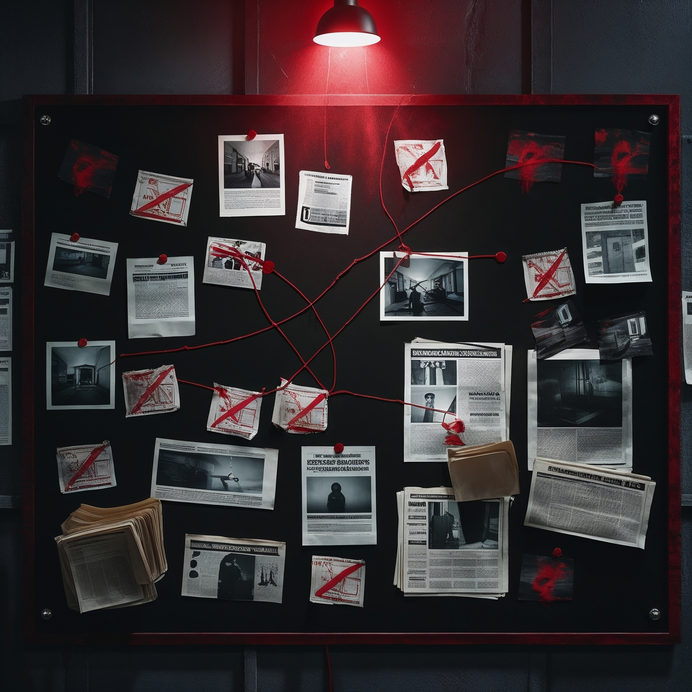

# 🕸️ THE NETWORK — Web3 Investigation Game

> Enquêtez. Interrogez. Exposez la vérité. Gagnez des $TRUTH tokens.

## 🎮 Play Now
👉 **[wkalidev.github.io/the-network-game](https://wkalidev.github.io/the-network-game)**

## 🔍 What is it?
A Web3 noir investigation game built on Base Network.
Uncover a criminal network involving the world's most powerful.
Interrogate AI-powered suspects. Collect evidence. Earn $TRUTH tokens.

## ⚡ Features
- 🤖 AI-powered suspect interrogations (Claude Sonnet)
- 📁 7 pieces of evidence to collect
- 💀 5 suspects to unlock
- ◈ $TRUTH token reward system
- 🌍 4 languages — FR / EN / IT / ES
- 📱 Mobile first design
- ⛓️ Base Network smart contract

## 🛠️ Tech Stack
React · Vite · Solidity · Base Network · Claude AI · GitHub Pages

## 🚀 Run locally
git clone https://github.com/wkalidev/the-network-game.git
cd the-network-game
npm install
npm run dev

## ⛓️ Smart Contract
TruthToken.sol — Base Network (chainId 8453)
ERC-20 · ReentrancyGuard · ECDSA Signatures · Anti-bot

## 👤 Built by
**wkalidev** ·zcodebase·
Twitter: @willycodexwar · Farcaster: @willywarrior

---
*"La vérité ne peut pas être effacée"*
